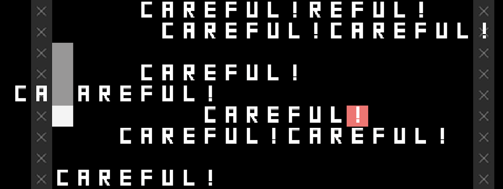

# SNAKISTS

# [Play Online](../index.html) (Mobile and desktop)

## Description

*Twenty ways to think about a snake! Is it an alarmist?! A nudist?! A conformist?! Crossing tasks off its checklist!? Or just doing the twist!? You get the gist!*

*SNAKISTS* is a direct sequel to [*SNAKISMS*](https://pippinbarr.com/SNAKISMS/info/). I thought it would be pretty fun to take on the variations challenge with Snake one more time. The world of ists is a weirder and less philosophical world than the isms, and so are the games. Heist, typist, ... onanist. You know you want to.

*SNAKISTS* was created using [Phaser 3](https://phaser.io/) along with [Hammer.js](https://hammerjs.github.io/) for touch gestures (swipes).

## Press

Read the [Press Kit](../press) for press information

## Documentation

* Read the [Process Documentation](../process) for todos and design explorations
* Read the [Commit History](https://github.com/pippinbarr/SNAKISTS/commits/main) for detailed, moment-to-moment insights into the development process
* Look at the [Code Repository](https://github.com/pippinbarr/SNAKISTS)

## License
*SNAKISTS* is licensed under a [Creative Commons Attribution-NonCommercial 4.0 Unported License](http://creativecommons.org/licenses/by-nc/4.0/).
 