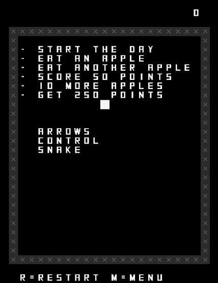
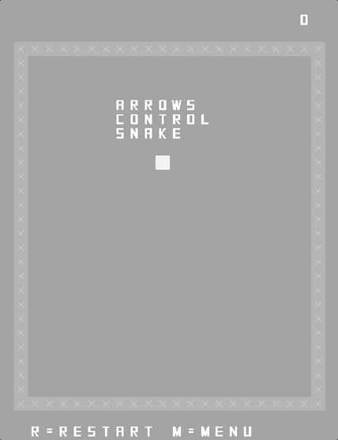
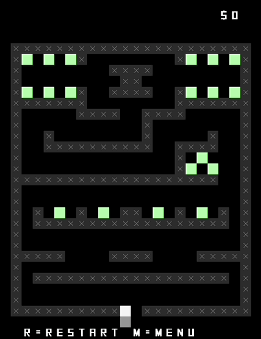
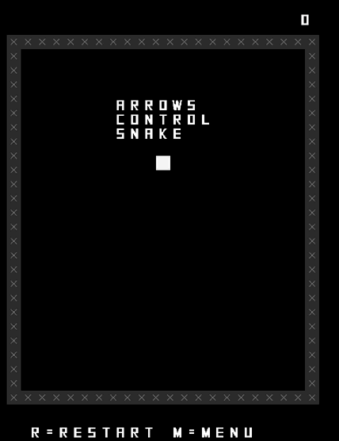

# *SNAKISTS* Press Kit

### [Play Online](https://pippinbarr.com/SNAKISTS) (Mobile and desktop)

## The basics

* Developer: [Pippin Barr](http://www.pippinbarr.com/)
* Release: 16 April 2025
* Platform: Browser and mobile
* Code repository: https://www.github.com/pippinbarr/SNAKISTS/
* Price: $0.00

## Description

*Twenty ways to think about a snake! Is it an alarmist?! A nudist?! A conformist?! Crossing tasks off its checklist!? Or just doing the twist!? You get the gist!*

*SNAKISTS* is a direct sequel to [*SNAKISMS*](https://pippinbarr.com/SNAKISMS/info/). I thought it would be pretty fun to take on the variations challenge with Snake one more time. The world of ists is a weirder and less philosophical world than the isms, and so are the games. Heist, typist, ... onanist. You know you want to.

## History

I've been a fan of controled variations in game design for a long time, notably since making [*PONGS*](https://pippinbarr.com/pongs/info/) back in 2012 (13 years agooooooo). Since then I've turned to variations and adaptations often as a way to think about game design and play. Pong, Breakout, Chess, Combat, Snake, I have varied them all already, I have varied them all.

[*SNAKISMS*](https://pippinbarr.com/SNAKISMS/info/) is very close to my heart because it tied together a few obsessions of mine, specifically minimalist variations in game design, translation/adaptation of concepts/ideas into game form, and specifically philosophy. I started out thinking "I'll just make *SNAKISMS II* or something, but then realized that *SNAKISTS* is a very funny name for a sequeal. And then in reading the dictionary of words ending in -ist realised how funny it is that a *ton* of them are not about idealogical/philosophical positions. So *SNAKISTS* has ended up being a weird mix. A good weird mix.

## Technology

*SNAKISTS* was created using [Phaser 3](https://phaser.io/).

*SNAKISTS* is an open source game licensed under a [Creative Commons Attribution-NonCommercial 4.0 Unported License](http://creativecommons.org/licenses/by-nc/4.0/).

## Features

* Nudity
* Masturbation (sorry, it's NSFW - not snake for work)
* Robbery
* Religion
* Dancing

## GIFs

## Contact

* Email: [pippin.barr+press@gmail.com](mailto:pippin.barr+press@gmail.com)
* Website: [www.pippinbarr.com](http://www.pippinbarr.com/)
* Bluesky: [@pippinbarr](https://bsky.app/profile/pippinbarr.bsky.social)
