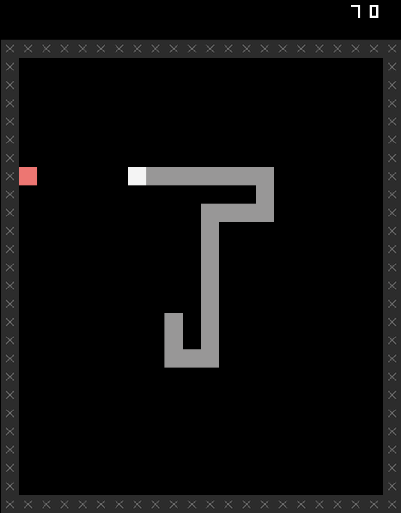
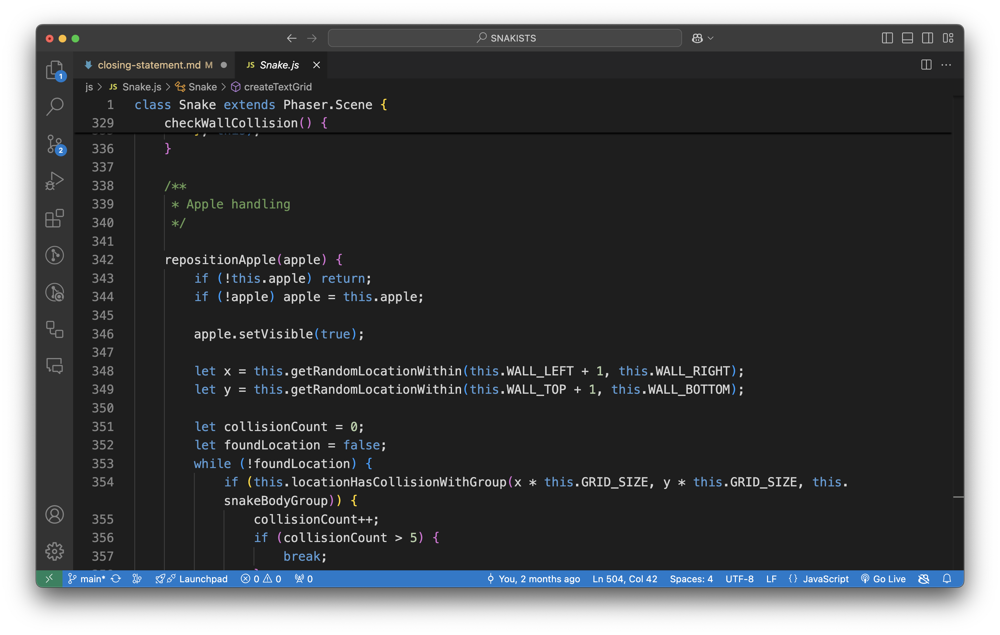
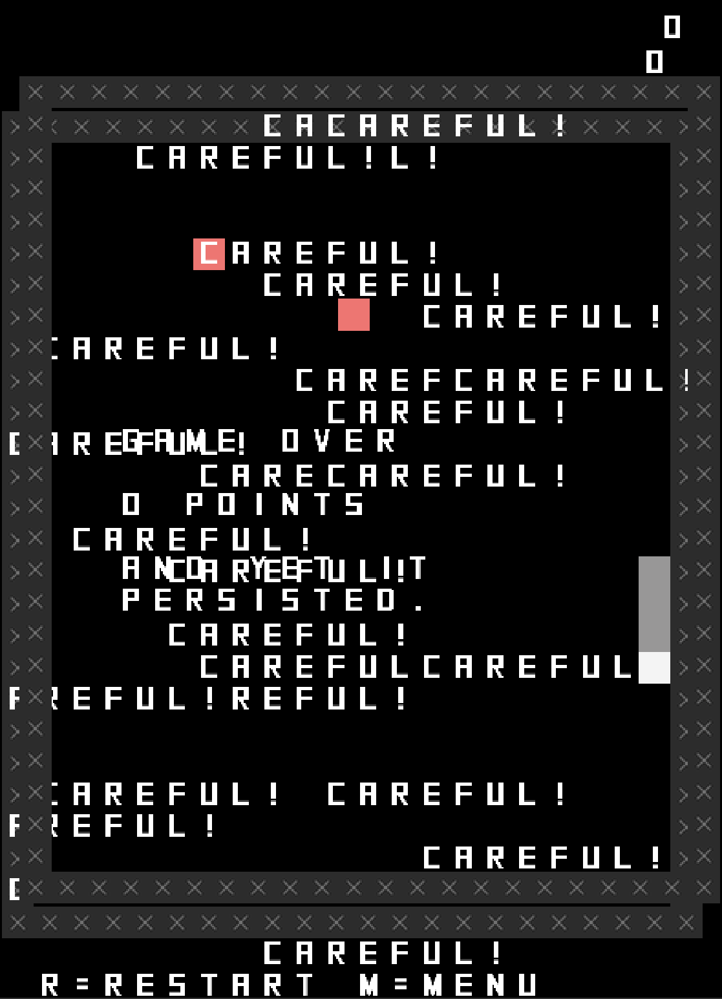

# Parseltongue? Designing in the Language of Snake

  
> *Snake*

The main reason I keep making games like *SNAKISTS* is because I fundamentally enjoy the sense it has a learning a new language, or learning a familiar language more thoroughly. At heart, these kinds of variation games driven by some overarching conceptual approach (philosophical positions, classic cinema, Greek mythology, words ending in -ist) are about figuring out what you can express with the underlying language of a simple game, such as Snake. Or, as I put it in the journal:

> Have said this plenty of times, but good to keep it in mind. An obvious way to think of this whole project is that Snake presents you with a language (or play) and the process becomes about how the Snake-language can “say” or “define” the word in question. And one thing that happens is you do run into how limited the Snake language is… it can’t say everything, some of the things require adding or changing so much stuff it’s questionable to say it’s still Snake? So that kind of range of power… the question of where the borders are, the question of which words are easy/difficult to say in Snake feels… revealing? About Snake?
>
> [`journal.md`, 25 March 2025](https://pippinbarr.com/SNAKISTS/process/journal.html#:~:text=Have%20said%20this,revealing%3F%20About%20Snake%3F)

So, one of the main threads of investigation in this particular process was around what you can and cannot (and maybe should not?) say in the gameplay language of Snake.

## Stating the obvious

One of the surprises of this whole project was an extension of an idea that had come up in *SNAKISMS*: creating a version of the game, based on a concept, that is just the game itself framed by that concept. So in *SNAKISMS* I made "Conservatism" which was literally just Snake itself, with the point being that the idea of Conservatism is being committed to traditional ways and values and avoiding/disliking change.

> *Snake*

In that case the point was to make a joke about "variation games" in a sense, to say that the variation in that case just *is* the base game. But in *SNAKISMS* there was only *one* of these, and it was specific and intentional. What I found in *SNAKISTS* was that I ran into *multiple* "-ists" that could be reasonably said to correspond to the base case of Snake, e.g.:

> But now I realize the NUDIST could be the one that's just normal snake hehe. Though I also thought of PURIST for that... so I dunno...
>
> [1488e266b05feee33ab33031b83807c138f562fc](https://github.com/pippinbarr/SNAKISTS/commit/1488e266b05feee33ab33031b83807c138f562fc)

All snakes, including the Snake snake, are "nudists" because they don't wear clothes. But a "purist" versino of Snake would presumably also just be unadulterated Snake as well. That's funny, but it led to some reflection on how this activity of thinking about "-ists" in relation to Snake was also a reflection on the underlying values of Snake itself, what kinds of cultural/political/social ideals it seems to embody (directly or metaphorically):

> The idea of -ists that end up just being Snake with no modifications. Purist, Nudist, Individualist, … – that’s both funny and kind of about the question of how you characterize underlying value or other systems of a game like Snake. Is Snake “fascist” in some way? Do videogames have inherent political or cultural alignments? It’s a pretty interesting question at the level of design? It might also be a (truly weird) kind of language/insight into why some forms of design are just harder than others? If Snake is a Fascist is it harder to create progressive revisions?
> 
> [`journal.md`, 25 March 2025](https://pippinbarr.com/SNAKISTS/process/journal.html#:~:text=The%20idea%20of%20%2Dists%20that%20end%20up%20just%20being%20Snake%20with%20no%20modifications)

I think there's almost an experimental process suggested here of taking a specific game (Snake would be fine) and testing it against diverse cultural/political/societal positions in terms of its expressive capacity. I'm sure there are other forms of analysis that could be applied here (interface inventory and that kind of stuff) but I quite like the idea of *interrogating a gameplay language/game design through design*, there's something neat to that as a methodology?

> *Fascist Snake?*

Even the very simple experimental setup suggested here is quite fun: take a simple game and then see how many cultural/political positions you can attribute to it *without change*. Snake seems comfortably conservative, individualistic, capitalistic, nudist, etc.? I was actually envisaging a game at some point where you inflect gameplay merely by *describing* it in different ways without changing it, which is another version of this approach. So this is perhaps a good example of how generative it can be to create these kinds of gameplay+idea setups.

## Hard to say

In the opposite direction, there were plenty of – really most – "-ists" that I either had no idea for, or for which my ideas kind of crumbled away on any deeper investigation, for instance:

> waist
> - Well we all have one. Does a snake have a waist? Is a snake all waist?
> - Is there anything to be done about this in a videogame?
>
> [`ists.md`, waist](https://pippinbarr.com/SNAKISTS/process/ists.html#:~:text=waist,in%20a%20videogame%3F)

Over time the weight of all these "-ists" I kind of had nothing for built into a feeling that was roughly the mirror of the idea of "going with the grain" of Snake's language. The idea that there are things you perhaps cannot or should not say with Snake, which is of course itself revealing about the nature of Snake (as a language):

> I think I'm running into some "helpful difficulties" around the sheer limits of the Snake universe; because I'm mostly trying to think in terms of minimally additive stuff, but a lot of ISTS (and all words) are understandably so far removed from what Snake world represents that it would take adding a lot of stuff to close the gap; which I think may contradict something wrote earlier about Snake being some kind of primitive Ur-language, haha
>
> [Commit 003ad65ef70a20e6b8882b444fdd18e9da57812d](https://github.com/pippinbarr/SNAKISTS/commit/003ad65ef70a20e6b8882b444fdd18e9da57812d)

So, probably unsurprisingly you can't say *absolutely anything* in the voice of a Snake. There are things that are easily and well said, things that are more of a struggle, and things about which we maybe must remain silent, though this raises specters of merely being a bad designer (poorly spoken) rather than that there's nothing there:

> There’s a whole category of words that I want to be able to Snake but don’t have an idea right away. Like, say, Fascist. But this also makes me wonder… if there’s not an idea almost instantly, given how simple the Snake language is, does that mean… there’s no idea to be had? To what extent can you worry the bone of Snake until you make something fit into it? Or is the language so simple there’s not much to be done?
>
> [`journal.md`, 25 March 2025](https://pippinbarr.com/SNAKISTS/process/journal.html#:~:text=There%E2%80%99s%20a%20whole,to%20be%20done%3F)

A good "in between" example of this was with the word "activist", which I was initially quite keen on:

> CANDIDATE activist
> There has to be a way this could work?
> “a person who campaigns to bring about political or social change.”
>
> [`ists.md`, activist](https://pippinbarr.com/SNAKISTS/process/ists.html#:~:text=CANDIDATE%20activist,or%20social%20change.%E2%80%9D)

The active nature of Snake alongside its focus on life or death situations, resources, the body, it all felt like it would clearly lead somewhere fruitful on the activist front:

> “a person who campaigns to bring about political or social change.”
>
> There has to be an option here, but one would also have to be careful that it isn’t just a flip idea about activism… it would need to actually do the work in some way. Like, can you make a Snake about Palestine? But also: is the game activist, is the Snake in the game an activist, is the player an activist by playing the game, …?
>
> Of those the game itself being activist makes the most sense to me? Could it be about settlers in Gaza? A gradual impingement on the Snake’s world by walls representing settlers?
>
> [`candidates.md`, Activist](https://pippinbarr.com/SNAKISTS/process/candidates.html#:~:text=There%20has%20to,walls%20representing%20settlers%3F)

> *Activist Snake?*

I was actually quite taken with my not-very-thought-through idea of taking on the idea of settlers within the world of Snake, but I also felt nervous about simply doing a bad job or missing something obvious. These aren't necessarily issues to wade into with your game design, especially in the context of a bunch of minigames that are framed around it being *funny* to redesign Snake over and over. The situation with Settlers in Palestine isn't funny.

Nonetheless, I wanted to do due dilligence and did ask my colleague Kevin Lo – a deeply experienced activist – what his thoughts were about my idea but also just the idea of an activist version of Snake more generally. This was my email, which I should really have put somewhere in the documentation, but at least now it's here:

> My inclination was to try to simulate settlers in Gaza by having the walls of the snake game randomly but inexorably encroach inwards over time, squeezing the snake out of space until it inevitably dies through a collision.
>
> With the idea that the game itself would then be living up to the idea of "activism". There's a spot at the end of the game on game over where I can insert a small text and I'd want to think about how to use that to nail down the messaging of the version.
>
> However! This is to some extent amateur hour! I'm not an activist and I don't want to be a dumbass about it or treat it as a flip joke... I think there's some potential for it to land in a useful way in the context of a more comic game... Because it's not funny, and its not funniness would be potentially enhanced/set off by the lightness of the other entries.
>
> But... What do you think?

We ended up having a good hallway conversation about this at work, the upshot of which was partly that the Settlers thing felt too simplistic and that anything around activism would need some kind of nuance/complexity – because activism is itself complex and nuanced:

> Kevin had a pretty cool response around the nature of activism and representing multiple snakes (activists) getting in each others’ way. But mostly it emphasized to me how it’s probably going to be very hard to do something that works in any meaningful way without going really far into redesign.
>
> [`candidates.md`, Activist](https://pippinbarr.com/SNAKISTS/process/candidates.html#:~:text=Kevin%20had%20a%20pretty%20cool%20response%20around%20the%20nature%20of%20activism%20and%20representing%20multiple%20snakes%20(activists)%20getting%20in%20each%20others%E2%80%99%20way.%20But%20mostly%20it%20emphasized%20to%20me%20how%20it%E2%80%99s%20probably%20going%20to%20be%20very%20hard%20to%20do%20something%20that%20works%20in%20any%20meaningful%20way%20without%20going%20really%20far%20into%20redesign.)

This is a pretty expansive discussion of a passage of design that didn't make it through, but I think that's valuable as well. In part because this is just the reality, but also because it does feel like it sheds some light on the specific questions of what a game can (or wants to?) say. You can easily end up tongue tied.

## Expanded vocabulary

A final observation on Snake language I returned to multiple times was around what exactly the bounds of that language should be. At the beginning of the project I would have instinctively answered that the language is the "Platonic" gameplay/rules of the old Nokia Snake, but I pretty quickly moved on to a more meta understanding as soon as I started actually *programming* some of the variations:

> Prototyping activates different thought processes and attentions and one thing I keep being aware of is the level of “materiality” I guess I’m dealing with here which is not “implementing Snake variations in JavaScript” and not even “implementing Snake variations in Phaser 3” but “implementing Snake variations on top of my existing framework for Snake from Let’s Snake and before that SNAKISMS”.
>
> [`journal.md`, 12 March 2025](https://pippinbarr.com/SNAKISTS/process/journal.html#:~:text=Prototyping%20activates%20different,before%20that%20SNAKISMS%E2%80%9D.)

> `Snake.js`

And as I noted in the following paragraph this really changes some of the affordances for how you then go about "telling the story" of different "-ists" because there's quite a lot more than just the base-level Snake-language that you're speaking:

> Which leads to very different kinds of thinking about what to do and how to do it - the framework literally has a spot to put extra after-death text for example, which encouraged me to think in that way; or just the idea of the definition screens still being built on the Snake class because it’s just easier to hide all the snake stuff and leave the words…
>
> [`journal.md`, 12 March 2025](https://pippinbarr.com/SNAKISTS/process/journal.html#:~:text=Which%20leads%20to,leave%20the%20words%E2%80%A6)

This expanded out to thinking about the *menu system* and the sort of persistent idea of *playing SNAKISMS* as fair game for interventions via the "ists". That's how we end up with "delist" just removing a menu item, and "persist" being a persistent game of Snake as you attempt to play other games in the collection.

> *Persist Snake over the top of Alarmist Snake*

> There’s something in here about how you view/frame the materials of making for this. Most obviously it’s Snake. But you could also say “Snake as implemented in Snake.js”. Or “Snake as it exists in Pippin’s mind” (reflected in my Snake document?) But you could also say “Snake as in the entire game including the menu” at which point you get something like “delist” or one of my ideas for “persist”.
>
> [`journal.md`, 25 March 2025](https://pippinbarr.com/SNAKISTS/process/journal.html#:~:text=There%E2%80%99s%20something%20in,ideas%20for%20%E2%80%9Cpersist%E2%80%9D.)

## Enough said

One of the things I'd been worried about, or at least conscious of, when I started in on *SNAKISTS* was the extent to which I was "just" doing it to have a kind of easy, repeated project that I didn't have to think too much about:

> Well, it begins. What am I doing? I’m avoiding working on other projects like a “game poem” and also the next step along the way of the It is as if projects. I’m doing that by making a sequel to SNAKISMS called SNAKISTS which allows me to do another suite of these stupid things with a slightly different flavour.
>
> [`journal.md`, 6 March 2025](https://pippinbarr.com/SNAKISTS/process/journal.html#:~:text=Well%2C%20it%20begins,slightly%20different%20flavour.)

But as I've hopefully demonstrated to myself in the process and in this closing statement, there was plenty of value in going through this particular design challenge again, including the ways in which the "ists" inflected it in different ways. Most of all I think it ended up being a story of really grappling quite directly and consciously with the idea of a game form as a language, and what it *means* when you can or cannot say certain things in that language. I think that's really fruitful and even could represent a very particularly kind of game design research methodology that I think is worth some further investigation.